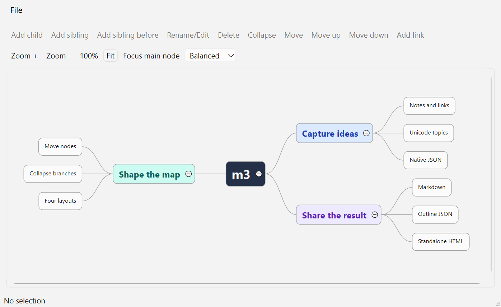

# m3

**Mindmap in Markdown**

A C++17 mind-map library with a public C API and an optional Qt Widgets editor. Use the Qt-free core in your application, or embed the editor to work with maps visually.



## Features

- **Structured maps:** ordered node hierarchies, cross-links, notes, hyperlinks, tags, icons and styles.
- **Portable documents:** native JSON preserves the semantic map. Import also accepts simple nested trees and compatible Mind Elixir documents.
- **Export:** Markdown and a six-level outline JSON projection in the core; standalone HTML export in the Qt editor. These exports are not full-fidelity round-trip formats.
- **Layout:** balanced, left, right and outline layouts, with collapsed branches retained in the document.
- **Interactive editing:** inline topics, drag-and-drop moving, node properties, configurable shortcuts, zoom and pan.

## Build the core

Requires a C++17 toolchain and CMake 3.18 or newer. The CTest commands below require CMake/CTest 3.20 or newer. Qt is not required for the core.

Run from the repository root; these commands work in PowerShell and POSIX shells:

```sh
cmake -S . -B build/core -DCMAKE_BUILD_TYPE=Debug -DM3_BUILD_SHARED=ON -DM3_BUILD_TESTS=ON
cmake --build build/core --config Debug
ctest --test-dir build/core -C Debug --output-on-failure
cmake --install build/core --config Debug --prefix build/install
```

Use a separate build directory when changing generators or toolchains. `CMAKE_BUILD_TYPE` selects the configuration for single-config generators; `--config` and CTest's `-C` select it for multi-config generators such as Visual Studio.

| CMake option | Default | Purpose |
| --- | --- | --- |
| `M3_BUILD_SHARED` | `ON` | Build the core as a shared library; set `OFF` for static. |
| `M3_BUILD_TESTS` | `ON` at the top level | Build and register the CTest cases. |
| `M3_BUILD_QT` | `OFF` | Build the shared Qt editor library. |
| `M3_BUILD_QT_DEMO` | Value of `M3_BUILD_QT` | Build the demo; requires `M3_BUILD_QT=ON`. |

## Run the Qt demo

The editor requires Qt 6.5 or newer with Widgets; building its tests also requires Qt Test. Make the matching Qt kit discoverable through `CMAKE_PREFIX_PATH` or `Qt6_DIR`.

For Windows with Visual Studio 2022 and an x64 MSVC Qt kit:

```powershell
cmake -S . -B build/qt -G "Visual Studio 17 2022" -A x64 -DCMAKE_BUILD_TYPE=Debug -DM3_BUILD_SHARED=ON -DM3_BUILD_QT=ON -DM3_BUILD_QT_DEMO=ON -DM3_BUILD_TESTS=ON
cmake --build build/qt --config Debug
ctest --test-dir build/qt -C Debug --output-on-failure
cmake --install build/qt --config Debug --prefix build/install-qt
./build/install-qt/bin/m3_qt_demo.exe
```

Installation deploys Qt runtime dependencies on Windows. With no argument the demo opens its built-in sample map; pass one JSON file to open your own. The screenshot above shows a custom example map in the demo.

CTest runs Qt cases offscreen. Do not set `QT_QPA_PLATFORM=offscreen` globally when launching the interactive demo.

## Embed the library

After installation, add the install prefix to your application's `CMAKE_PREFIX_PATH`. For an existing CMake application target named `my_app`, link the Qt-free core with:

```cmake
find_package(m3 CONFIG REQUIRED)
target_link_libraries(my_app PRIVATE m3::core)
```

Include [`m3/m3.h`](include/m3/m3.h) for document operations or [`m3/m3_layout.h`](include/m3/m3_layout.h) for layout. The C API uses borrowed NUL-terminated UTF-8 inputs and owned output snapshots. Check `M3Status`, inspect `m3_last_error()` on failure, and release outputs with `m3_string_free()` or `m3_layout_result_free()`. Destroy model handles with `m3_mindmap_destroy()`; failed mutations leave the document unchanged.

To embed the Qt editor instead, request its package component:

```cmake
find_package(m3 CONFIG REQUIRED COMPONENTS qt_editor)
target_link_libraries(my_app PRIVATE m3::qt_editor)
```

[`m3::qt::MindMapEditor`](include/m3/qt/editor.h) is a `QWidget` that owns its model. Hosts provide a `QApplication`, use the GUI thread, and retain control of file handling and URL activation. Selection, layout direction, zoom and pan are view state, not persisted JSON. Core-only package discovery does not require Qt.

For shared-library builds, make the m3 runtime libraries available to your application; the Qt editor also needs its matching Qt runtime and plugins. See the installed-package [core consumer](tests/consumer/CMakeLists.txt) and [Qt consumer](tests/qt_consumer/CMakeLists.txt) examples for linking and Windows DLL copying.

## Development

- [`include/m3/`](include/m3/) contains the public API; [`src/`](src/) implements the core and optional Qt layer.
- [`examples/`](examples/) contains the Qt demo and its open/save/export actions.
- [`tests/`](tests/) covers model, layout, ownership, allocation failures and Qt behavior. The [CI workflow](.github/workflows/ci.yml) also validates installed packages on Windows/Linux for the core and Windows for Qt.
- [`AGENTS.md`](AGENTS.md) documents architecture, coding patterns and focused test commands.

## License

Licensed under the [GNU Lesser General Public License v3.0](LICENSE). Bundled third-party components retain their own license notices in [`third_party/`](third_party/).
